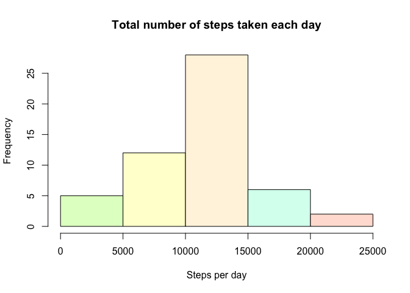
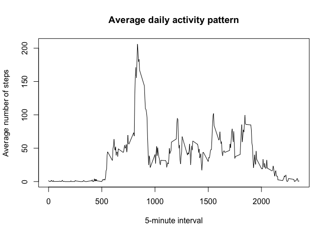
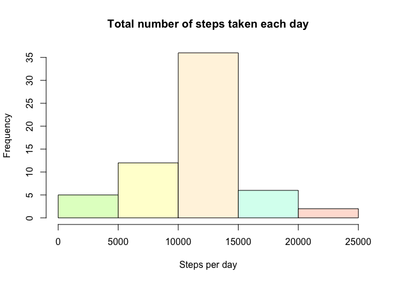

# PA1_template.Rmd
Luis T T  
8 May 2015  

###Loading and preprocessing the data
The first steps are:

1. Load the data from the file

2. Change the format of the data column as Date


```r
unzip("activity.zip")
data <- read.csv("activity.csv")
data$date <- as.Date(data$date)
```

###What is mean total number of steps taken per day?
We proceed to calculate the total number of steps taken per day

```r
steps_day <- aggregate(data$steps,data.frame(data$date),sum)
names(steps_day) <- c('date','steps')
```

And create a histogram of the total number of steps taken each day

```r
colors <- c("#E1FFCA","#FFFED4","#FFF4E0","#D8FFF0","#FFE0D6")
hist(steps_day$steps,col=colors,main="Total number of steps taken each day",xlab="Steps per day")
```

 

After, we calculate the **mean** and **median** of the total number of steps per day

```r
print(mean(steps_day$steps,na.rm=T))
```

```
## [1] 10766.19
```

```r
print(median(steps_day$steps,na.rm=T))
```

```
## [1] 10765
```

###What is the average daily activity pattern?
First at all, we should aggregate the data per inverval and day

```r
inter_agg <- aggregate(data$steps,data.frame(data$interval),mean,na.rm=T)
names(inter_agg) <- c("interval","mean")
```

and create a plot which shows the answer:

```r
plot(inter_agg$interval,inter_agg$mean,type="l", xlab="5-minute interval",
    ylab="Average number of steps",main="Average daily activity pattern")
```

 

Finally, here can see which **5-minute interval** contains the maximun number of steps

```r
inter_agg[order(inter_agg$mean, decreasing = T),][1,1]
```

```
## [1] 835
```

###Imputing missing values
Let's see how many missing values we have in the original dataset

```r
sum(is.na(data$steps))
```

```
## [1] 2304
```

We decided, that the NA values, will get the mean of the same interval. First, we select all data with missing values, and later those will get the mean from the same interval

```r
no_data <- data[is.na(data$steps),]
no_data[,1] <- inter_agg$mean
```

And finally, create a new dataset with all data together and sorted by date

```r
filled_data <- rbind(data[!is.na(data$steps),],no_data)
filled_data <- filled_data[order(filled_data$date, decreasing = F),]
```

Here we can see a histogram of the total number of steps taken each day.
Group the data

```r
steps_day_new <- aggregate(filled_data$steps,data.frame(filled_data$date),sum)
names(steps_day_new) <- c('date','steps')
```

And creating the histogram

```r
hist(steps_day_new$steps,col=colors,main="Total number of steps taken each day",xlab="Steps per day")
```

 

Also we are going to get the **mean** and **median**, and as we can see, the median is different from the previous one.

```r
print(mean(steps_day_new$steps,na.rm=T))
```

```
## [1] 10766.19
```

```r
print(median(steps_day_new$steps,na.rm=T))
```

```
## [1] 10766.19
```

###Are there differences in activity patterns between weekdays and weekends?
Let's create a new factor variable in the dataset

```r
data_week <- filled_data

data_week$type_day <- factor( 
    ifelse(weekdays(filled_data$date)=="Saturday" | 
               weekdays(filled_data$date)=="Sunday","weekend","weekday"))
```
it will take the values `weekend` or `weekday` depend on the day of the week

Due to, we want make a panel plot containing a time series plot of the 5-minute interval and the average number of steps taken. We need to prepare the data

```r
data_week <- aggregate(data_week$steps, cbind(data.frame(data_week$interval), 
                                              data.frame(data_week$type_day)),mean)
names(data_week) <- c("interval","type_day","steps")
```

And finally, the plot

```r
library(lattice)
xyplot(steps ~ interval | type_day, data= data_week, layout=c(1,2), type="l")
```

 

As you can see, we could say that the average activiy on weekend is higher than in a weekday. In week day, the activity is centred in the beginning of the day, meanwhile on weekend days the activity spread all over the day.
